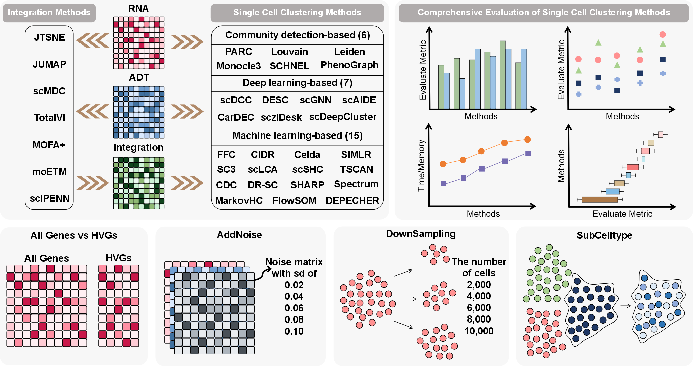

# Comparative benchmarking of single-cell clustering algorithms for transcriptomic and proteomic data

## Description
We performed a comparative benchmarking analysis of **28** clustering methods using paired single-cell transcriptomic and proteomic data. We evaluated these methods based on metrics such as ARI, NMI, CA, and Purity, as well as running time and peak memory consumption. The benchmarking results help compare the performance of these methods on real and simulated datasets, providing insights into the strengths and limitations of each approach for single-cell omics data analysis. Here is the pipeline for our benchmarking work.



These methods utilize a variety of clustering strategies, including community detection-based, machine learning-based, deep learning-based, to analyze and cluster single-cell transcriptomic and proteomic data. Below is a collection of useful links and titles for each method.

## Clustering Algorithms List
### 
|ID | Methods                                                                 | Title                                                                                                               |PMID|
|:-------:|:------------------------------------------------------------------------:|---------------------------------------------------------------------------------------------------------------------|:--:|
|1| [SC3](https://bioconductor.org/packages/release/bioc/html/SC3.html)  | SC3: Consensus clustering of single-cell RNA-seq data.                                                              |[28346451](https://pubmed.ncbi.nlm.nih.gov/28346451/)|
|2| [FFC](https://github.com/gersteinlab/forest-fire-clustering)         | Forest Fire Clustering for single-cell sequencing combines iterative label propagation with parallelized Monte Carlo simulations. |[35725981](https://pubmed.ncbi.nlm.nih.gov/35725981/)|
|3| [CDC](https://github.com/ZPGuiGroupWhu/ClusteringDirectionCentrality) | Clustering by measuring local direction centrality for data with heterogeneous density and weak connectivity.      |[36114209](https://pubmed.ncbi.nlm.nih.gov/36114209/)|
|4| [CIDR](https://github.com/VCCRI/CIDR)                                | CIDR: Ultrafast and accurate clustering through imputation for single-cell RNA-seq data.                            |[28351406](https://pubmed.ncbi.nlm.nih.gov/28351406/)|
|5| [PARC](https://github.com/ShobiStassen/PARC)                          | PARC: ultrafast and accurate clustering of phenotypic data of millions of single cells.                            |[31971583](https://pubmed.ncbi.nlm.nih.gov/31971583/)|
|6| [DESC](https://eleozzr.github.io/desc/)                               | Deep learning enables accurate clustering with batch effect removal in single-cell RNA-seq analysis.               |[32393754](https://pubmed.ncbi.nlm.nih.gov/32393754/)|
|7| [Celda](https://github.com/campbio/celda)                            | Celda: a Bayesian model to perform co-clustering of genes into modules and cells into subpopulations using single-cell RNA-seq data. |[36110899](https://pubmed.ncbi.nlm.nih.gov/36110899/)|
|8| [scLCA](https://bitbucket.org/scLCA/single_cell_lca/src/master/)     | Latent cellular analysis robustly reveals subtle diversity in large-scale single-cell RNA-seq data.                 |[31566233](https://pubmed.ncbi.nlm.nih.gov/31566233/)|
|9| [DR-SC](https://github.com/feiyoung/DR-SC.Analysis)                  | Joint dimension reduction and clustering analysis of single-cell RNA-seq and spatial transcriptomics data.          |[35349708](https://pubmed.ncbi.nlm.nih.gov/35349708/)|
|10| [scDCC](https://github.com/ttgump/scDCC)                             | Model-based deep embedding for constrained clustering analysis of single cell RNA-seq data.                        |[33767149](https://pubmed.ncbi.nlm.nih.gov/33767149/)|
|11| [SIMLR](https://www.bioconductor.org/packages/release/bioc/html/SIMLR.html) | Visualization and analysis of single-cell RNA-seq data by kernel-based similarity learning.                 |[28263960](https://pubmed.ncbi.nlm.nih.gov/28263960/)|
|12| [Leiden](https://scanpy.readthedocs.io/en/stable/)                    | From Louvain to Leiden: guaranteeing well-connected communities.                                                  |[30914743](https://pubmed.ncbi.nlm.nih.gov/30914743/)|
|13| [TSCAN](https://github.com/zji90/TSCAN)                              | TSCAN: Pseudo-time reconstruction and evaluation in single-cell RNA-seq analysis.                                  |[27179027](https://pubmed.ncbi.nlm.nih.gov/27179027/)|
|14| [SHARP](https://github.com/shibiaowan/SHARP)                         | SHARP: hyperfast and accurate processing of single-cell RNA-seq data via ensemble random projection.               |[31992615](https://pubmed.ncbi.nlm.nih.gov/31992615/)|
|15| [scGNN](https://github.com/juexinwang/scGNN)                         | scGNN is a novel graph neural network framework for single-cell RNA-Seq analyses.                                  |[33767197](https://pubmed.ncbi.nlm.nih.gov/33767197/)|
|16| [scAIDE](https://github.com/tinglabs/scAIDE)                         | scAIDE: clustering of large-scale single-cell RNA-seq data reveals putative and rare cell types.                   |[33575628](https://pubmed.ncbi.nlm.nih.gov/33575628/)|
|17| [sc-SHC](https://github.com/igrabski/sc-SHC)                         | Significance analysis for clustering with single-cell RNA-sequencing data.                                         |[37429993](https://pubmed.ncbi.nlm.nih.gov/37429993/)|
|18| [Louvain](https://scanpy.readthedocs.io/en/stable/)                   | Fast unfolding of communities in large networks.  |[Link](https://iopscience.iop.org/article/10.1088/1742-5468/2008/10/P10008/meta)|
|19| [CarDEC](https://github.com/jlakkis/CarDEC)                          | A joint deep learning model enables simultaneous batch effect correction, denoising, and clustering in single-cell transcriptomics. |[34035047](https://pubmed.ncbi.nlm.nih.gov/34035047/)|
|20| [SCHNEL](https://github.com/biovault/SCHNELpy)                        | SCHNEL: scalable clustering of high dimensional single-cell data.                                                  |[33381821](https://pubmed.ncbi.nlm.nih.gov/33381821/)|
|21| [scziDesk](https://github.com/xuebaliang/scziDesk)                   | Deep soft K-means clustering with self-training for single-cell RNA sequence data.                                  |[33575592](https://pubmed.ncbi.nlm.nih.gov/33575592/)|
|22| [DEPECHE](https://www.bioconductor.org/packages/release/bioc/html/DepecheR.html) | Determination of essential phenotypic elements of clusters in high-dimensional entities—DEPECHE.        |[30845234](https://pubmed.ncbi.nlm.nih.gov/30845234/)|
|23| [FlowSOM](https://github.com/SofieVG/FlowSOM)                        | FlowSOM: Using self-organizing maps for visualization and interpretation of cytometry data.                         |[25573116](https://pubmed.ncbi.nlm.nih.gov/25573116/)|
|24| [Spectrum](https://cran.r-project.org/web/packages/Spectrum/index.html) | Spectrum: fast density-aware spectral clustering for single and multi-omic data.                                 |[31501851](https://pubmed.ncbi.nlm.nih.gov/31501851/)|
|25| [Monocle3](https://cole-trapnell-lab.github.io/monocle3/docs/clustering/) | The single-cell transcriptional landscape of mammalian organogenesis.                                          |[30787437](https://pubmed.ncbi.nlm.nih.gov/30787437/)|
|26| [MarkovHC](https://github.com/ZhenyiWangTHU/MarkovHC)  | MarkovHC: Markov hierarchical clustering for the topological structure of high-dimensional single-cell omics data with transition pathway and critical point detection. |[34850940](https://pubmed.ncbi.nlm.nih.gov/34850940/)|
|27| [PhenoGraph](https://github.com/dpeerlab/PhenoGraph)                  | Data-driven phenotypic dissection of AML reveals progenitor-like cells that correlate with prognosis.               |[26095251](https://pubmed.ncbi.nlm.nih.gov/26095251/)|
|28| [scDeepCluster](https://github.com/ttgump/scDeepCluster_pytorch)     | Clustering single-cell RNA-seq data with a model-based deep learning approach.      |[Link](https://www.nature.com/articles/s42256-019-0037-0)|

## Implementation
To ensure the environment is properly configured for the specific requirements of each clustering method, begin by confirming that all dependencies and packages required by both Python and R scripts are installed. After the environment setup is complete, proceed to perform benchmarking tests for the clustering methods by running the following scripts:

### For Python-based Clustering Algorithms
- **Scripts**:
  - `./ClusteringAlgorithms_Python/script_rna_adt_clustering.py`
  - `./ClusteringAlgorithms_Python/script_integration_clustering.py`
- **Purpose**: These scripts implement and evaluate various Python-based clustering algorithms, providing insights into the efficiency and accuracy of each method.
- **Execution**: Run the scripts in your Python environment.
  ```bash
  python script_rna_adt_clustering.py
  python script_integration_clustering.py

### For R-based Clustering Algorithms
- **Scripts**:
  - `./ClusteringAlgorithms_R/script_rna_adt_clustering.R`
  - `./ClusteringAlgorithms_R/script_integration_clustering.R`
- **Purpose**: These scripts implement and evaluate various R-based clustering algorithms, providing insights into the efficiency and accuracy of each method.
- **Execution**: Run the scripts in your R environment.
  ```R
  source("script_rna_adt_clustering.R")
  source("script_integration_clustering.R")

## Acknowledgments
We would like to express our sincere appreciation to the developers of the single-cell clustering methods  and multi-omics integration approaches included in this benchmark. Their pioneering work has significantly advanced the field, making it possible to conduct in-depth analyses of multi-omics data.
